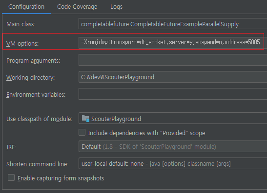

## Scouter를 이용한 프로파일링

Scouter를 이용한 비동기 스레드 프로파일링 및 몇 가지 tip에 대해서 정리해
보았습니다.

APM 동작 방식에 대한 이해도 같이 도움 되시면 좋겠습니다.

프로파일링에 앞서서 간단하게 용어 정리하겠습니다.

</br>

### APM(Application Performence Management) 이란?
웹 어플리케이션, 서버 시스템 등의 성능을 관리하는 솔루션입니다. 어플리케이션이나 시스템의 신속한 장애 지점 파악, 원인 분석, 튜닝을 지원할 수 있는 APM을 도입하면 서비스를 안정적으로 제공할 수 있습니다. (TunA에서 퍼 옴)

간단하게 APM 종류로는 국내에서 유명한 상용 APM **제니퍼**(제니퍼소프트)가 있고 **SysMaster**(티맥스소프트)라는 제품도 있습니다.

무료 오픈 소스로는 현재 티몬에서 사용중인 **Scouter**랑 **Pinpoint** 등이 있습니다.

</br>

### 프로파일링(profiling) 이란?
프로파일링 또는 성능 분석은 프로그램의 시간 복잡도 및 공간, 특정 명령어 이용, 함수 호출의 주기와 빈도 등을 측정하는 동적 프로그램 분석의 한 형태
입니다. (wiki 펌)

프로파일러나 APM을 이용하여 특정 메서드, 클래스의 수행 시간, 호출 횟수, 리소스 사용량 등을 세부적으로 분석할 수 있습니다.

프로파일링을 할 때, BCI라는 기법을 많이 사용하는데요. BCI에 대해서 간단하게 살펴보겠습니다.

</br>

### BCI(Byte Code Instrumentation)란?
bytecode에 직접 변경을 가해 소스코드 수정 없이 원하는 기능을 삽입할 수 있는 방법으로 APM Agent에서 많이 사용되는 방식입니다.

BCI 종류로는 ASM, BCEL, SERP, JavaAssist 등이 있고 Scouter는 ASM 방식을 사용한다고 합니다.

**ASM 참고)** <https://asm.ow2.io/asm4-guide.pdf>

</br>

그렇다면 APM Agent를 단순 설치하는 것만으로 요청, 수행 쿼리 정보 등을 어떻게 수집하는 것일까요?

Scouter의 내부 로직은 잘 모르지만 Agent 소스를 간단하게 살펴보니 *jdbc, socket* 등 우리가 자주 사용하는

부분을 미리 BCI의 대상으로 등록시켜 놓았습니다.

등록된, 대상 클래스들이 로딩 될 때 bytecode를 변조해서 필요한 기능을 주입할
것입니다.

</br>

**scouter.agent / ApicallSpringHandleResponseASM.java**
``` java
public class ApicallSpringHandleResponseASM implements IASM, Opcodes {
 
   private Map<String, HookingSet> reserved = new HashMap<String, HookingSet>();
 
   public ApicallSpringHandleResponseASM() {
      AsmUtil.add(reserved, "org/springframework/web/client/RestTemplate", "handleResponse(Ljava/net/URI;Lorg/springframework/http/HttpMethod;Lorg/springframework/http/client/ClientHttpResponse;)V");
      AsmUtil.add(reserved, "org/springframework/web/client/AsyncRestTemplate", "handleResponseError(Lorg/springframework/http/HttpMethod;Ljava/net/URI;Lorg/springframework/http/client/ClientHttpResponse;)V");
      AsmUtil.add(reserved, "org/springframework/web/client/AsyncRestTemplate$ResponseExtractorFuture", "convertResponse(Lorg/springframework/http/client/ClientHttpResponse;)Ljava/lang/Object;");
   }
 
   @Override
   public ClassVisitor transform(ClassVisitor cv, String className, ClassDesc classDesc) {
      if (Configure.getInstance()._hook_apicall_enabled == false) {
         return cv;
      }
 
      HookingSet mset = reserved.get(className);
      if (mset != null)
         return new RestTemplateResponseHandlerCV(cv, mset, className);
      return cv;
   }
}
``` 

BCI의 동작원리와 성능에 대해 좀 더 궁금하시다면 아래 사이트를 참고하시기 바랍니다.

**참고)** <http://blog.dabomsoft.co.kr/220845105852?Redirect=Log&from=postView>

</br>

또한 Scouter에서는 **scouter.conf** 파일 설정을 통해서 hooking 대상을 제어하고 추가적인 프로파일링을 할 수 있습니다.

자세한 설정과 기본 값은 아래 사이트를 참고하시기 바랍니다.

**참고)** <https://github.com/scouter-project/scouter/blob/126bb19f07d1fe4fe915eb408c381e2c140cc94c/scouter.document/main/Configuration_kr.md>

</br>

### 어디가 병목인가?


Scouter에서 xlog를 확인할 때, 전체 수행 시간은 나오는데 병목지점에 대한 정보가 누락되는 경우가 있습니다.

비동기 스레드 내의 쿼리 수행이나 외부 API 호출 등이 원인일 수도 있습니다.

이런 경우 추가적인 프로파일링을 통해서 원인을 찾을 수 있습니다.

</br>

#### 1) NON-HTTP

**scouter.conf**
``` config
### scouter java agent configuration sample
net_collector_ip=127.0.0.1
net_collector_udp_port=6100
net_collector_tcp_port=6100
 
hook_service_patterns=
hook_async_callrunnable_scan_package_prefixes=
``` 

HTTP 서비스 같은 경우 **Controller, RestController** 등의 클래스들을 자동으로 hooking 하고 있어서 별도 시작점을 잡을 필요가 없습니다.

반면 NON-HTTP 서비스는 xlog를 보기 위해 scouter.conf의 **hook_service_patterns** 옵션을 이용하여 시작 메서드를 등록해 주어야 합니다.

xlog가 정상 노출되면, 비동기 스레드를 추적하기 위해 **hook_async_callrunnable_scan_package_prefixes** 옵션을 이용하면 됩니다.

**hook_async_callrunnable_scan_package_prefixes** 에는 runnable, callable의 구현 패키지를 등록해 주시면 됩니다.

패키지가 여러 개인 경우 콤마(,)로 구분됩니다.

**참고)** <https://github.com/scouter-project/scouter/blob/master/scouter.document/use-case/NON-HTTP-Service-Trace_kr.md>

</br>

몇 가지 예제를 보겠습니다.

</br>

#### 1-1) Runnable 구현 클래스 사용

**RunnableClass**
``` java
package runnable;
import worker.*;
 
public class RunnableClass {
   public static void main(String[] args) {
      Runnable runnable = new Worker();
      Thread thread = new Thread(runnable);
      thread.start();
   }
}
``` 

</br>

**Worker**
``` java
package worker;
 
public class Worker implements Runnable {
   @Override public void run() {
      try {
         Thread.sleep(3000);
      } catch (InterruptedException e) {
         e.printStackTrace();
      }
   }
}
``` 

</br>

**scouter.conf**
``` config
hook_async_callrunnable_enabled=true                  // 생략 가능
hook_service_patterns=runnable.RunnableClass.main
hook_async_callrunnable_scan_package_prefixes=worker  // Runnable이 구현되어 있는 패키지
``` 

애플리케이션의 시작 메서드를 **hook_service_patterns** 에 등록 후, Runnable이 구현되어 있는 worker 패키지를
**hook_async_callrunnable_scan_package_prefixes** 에 설정해 주었습니다.

</br>

**결 과**


</br>

#### 1-2) Runnable 익명 클래스 사용
**RunnableAnonymousClass**
``` java
package runnable;
 
public class RunnableAnonymousClass {
   public static void main(String[] args) {
      Runnable runnable = new Runnable() {
         @Override
         public void run() {
            try {
               Thread.sleep(3000);
            } catch (InterruptedException e) {
               e.printStackTrace();
            }
         }
      };
      Thread thread = new Thread(runnable);
      thread.start();
   }
}
```

</br>

**scouter.conf**
``` config
hook_async_callrunnable_enabled=true                        // 생략 가능
hook_service_patterns=runnable.RunnableAnonymousClass.main
hook_async_callrunnable_scan_package_prefixes=runnable      // Runnable이 구현되어 있는 패키지
있는 패키지
```

</br>

**결 과**


</br>

**Runnable 구현 클래스 형태** 와 다른 점은 익명 클래스를 호출하는 클래스의 패키지를 **hook_async_callrunnable_scan_package_prefixes** 에 등록해 주어야 합니다.

**주의점**은 **hook_service_patterns=runnable.\*.\*** 같이 전체 패키지를 시작점으로 잡으면 Main 스레드, 익명 클래스로 만든 비동기 스레드 두 개가 시작점이 되기 때문에 서로 독립적인 스레드로 인식되어서 call이 되지 않습니다.

</br>

#### 1-3) ExecutorService
ExecustorService도 결국 runnable, callable을 사용하기 때문에 방식은 비슷합니다.

**FutureExample**
``` java
package executor;
import java.util.concurrent.*;
 
public class ExecutorServiceClass {
   public static void main(String[] args) throws ExecutionException, InterruptedException {
      ExecutorService executorService = Executors.newFixedThreadPool(5);
      Future future = executorService.submit(new Callable<String>() {
         @Override public String call() throws Exception {
            Thread.sleep(3000);
            return "Callable Result";
         }
      });
      System.out.println(future.get());
      executorService.shutdown();
   }
}
``` 

</br>

**scouter.conf**
``` config
hook_async_callrunnable_enabled=true                       // 생략 가능
hook_service_patterns=executor.ExecutorServiceClass.main
hook_async_callrunnable_scan_package_prefixes=executor     // Callable이나 Runnable이 구현되어 있는 패키지
``` 

또는 스레드풀 방식을 이용할 수 있습니다.

**scouter.conf**
``` config
hook_service_patterns=executor.ExecutorServiceClass.main
hook_async_thread_pool_executor_enabled=true               // 필수 선언 (기본값 : false)
``` 

</br>

**결 과**


**hook_async_callrunnable_scan_package_prefixes** 을 이용해서 직접 패키지를 등록하거나

**hook_async_thread_pool_executor_enabled** 플래그를 활성화시켜서 **ThreadPoolExecutor** 의 특정 메서드로 자동 추적하는 방법이 있습니다.

**hook_async_thread_pool_executor_enabled** 을 사용할 경우 제약 사항으 Scouter 내부의 등록 과정 때문에 스레드풀 설정 개수 이상 호출이 돼야 정상적으로 call 됩니다.

ex) 스레드풀 개수가 2개라면 3번째 호출부터 정상적으로 출력됩니다.

스레드풀 방식은 옵션이 전역으로 선언되기 때문에 의도하지 않은 정보까지 노출되어 수집 서버에 부담을 줄 수 있습니다.

dev, stage에서 확인하고 real에서 꼭 필요할 경우에는 병목 확인 후, 해당 옵션을 off 하는 것을 추천드립니다.

</br>

#### 1-4) CompletableFuture
**CompletableFutureClass**
``` java
package completablefuture;
import java.util.concurrent.CompletableFuture;
 
public class CompletableFutureClass {
   public static void main(String[] args) {
      CompletableFuture<Void> cf = CompletableFuture.runAsync(new Runnable() {
         @Override
         public void run() {
            try {
               Thread.sleep(3000);
            } catch (InterruptedException e) {
               e.printStackTrace();
            }
         }
      });
      cf.join();
   }
}
``` 

</br>

**scouter.conf**
``` config
hook_async_callrunnable_enabled=true
hook_service_patterns=completablefuture.CompletableFutureClass.main
hook_async_callrunnable_scan_package_prefixes=completablefuture
``` 

</br>

**결 과**


앞의 예제에서 보신 것과 같이 대부분의 경우 **Callable,Runnable, ThreadPoolExecutor** 등을 이용하면 비동기 스레드를 추적할 수 있습니다.

단 **예외**가 있는데 java8부터 지원하는 람다 방식은 정상 추적이 불가합니다. 이유와 대안은 **3) LambdaExpression** 을 확인하시기 바랍니다.

</br>

#### 2) HTTP 서비스

HTTP 서비스 애플리케이션은 **Controller, RestController** 등의 클래스들을
자동으로 추적하고 있어서

**hook_service_patterns** 에 메서드를 등록해주지 않아도 xlog에 출력됩니다.

</br>

#### 2-1) \@Async annotation

**\@Async**
``` java
@Async("engineTaskExecutor")
public void asyncProcess(String uuid, EngineRequest engineRequest) {
   process(uuid, engineRequest);
}
``` 

</br>

**scouter.conf**
``` config
hook_spring_async_enabled=true  // 생략 가능
```

</br>

**결 과**


**\@Async** 관련 코드들도 Scouter Agent에 등록되어 있기 때문에 별도의 프로파일링이 필요 없습니다.

**hook_spring_async_enabled  **옵션으로 사용 유/무를 지정할 수 있습니다.

</br>

**scouter.agent / CallRunnableASM.java**
``` java
public class SpringAsyncExecutionASM implements IASM, Opcodes {
   private static List<String> asyncSubmitPatterns = new ArrayList<String>();
 
   static {
      asyncSubmitPatterns.add("org.springframework.aop.interceptor.AsyncExecutionAspectSupport.doSubmit(Ljava/util/concurrent/Callable;Lorg/springframework/core/task/AsyncTaskExecutor;Ljava/lang/Class;)Ljava/lang/Object;");
   }
...(생략)
}
``` 

</br>

#### 3) LambdaExpression

**LambdaExpression**
``` java
package runnable;
import worker.WorkerThread;
 
public class RunnableLambdaExpression {
   public static void main(String[] args) {
      Runnable runnable = () -> new WorkerThread().run();
      Thread thread = new Thread(runnable);
      thread.start();
   }
}
``` 

</br>

**scouter.conf**
``` config
hook_async_callrunnable_enabled=true
hook_service_patterns=runnable.RunnableLambdaExpression.main
hook_async_callrunnable_scan_package_prefixes=runnable
``` 

</br>

**결 과**


람다로 구현된 비동기 스레드는 **hook_async_callrunnable_scan_package_prefixes**을 사용해도 추적 되지 않았습니다.

확인 결과 람다에 대한 정상적인 hooking이 불가하여 **미지원** 상태라고 합니다.

(익명 클래스와 달리 람다의 생성과정은 조금 다르기 때문에, 생성에 필요한 LambdaMetafactory.metafactory를 ASM을 통해서 hooking 하려고 했지만,

특정 상황에서 이슈가 발생해서 지금은 미지원)

**hook_lambda_instrumentation_strategy_enabled** 라는 옵션을 지원 중이지만 버그도 많고 안정성 문제로 **deprecated** 된다고 합니다.

``` java
@ConfigDesc("Experimental! test it on staging environment of your system before enable this option.\n enable lambda expressioned class hook for detecting asyncronous processing. \nOnly classes under the package configured by 'hook_async_callrunnable_scan_package_prefixes' is hooked.")
boolean hook_lambda_instrumentation_strategy_enabled=false (Default=false)
``` 

</br>

결론은 **'람다 방식으로 생성된 비동기 스레드는 추적할 수 없다'** 입니다.

**SpringCamp2017[비동기 어플리케이션, 어떻게 모니터링 할 것인가?]** 의 후반부를 보시면 왜 람다가 왜  hooking 하기 어려운지 나옵니다. 관심 있으 신분은 참고하시기 바랍니다.

참고) <https://www.youtube.com/watch?v=dc54SR4Wdb4> (30분 50초)

</br>

#### 대 안

#### 3-1) 비동기 스레드를 시작점으로 등록

**RunnableLambdaExpression**
``` java
package runnable;
 
import worker.Worker;
 
public class RunnableLambdaExpression {
   public static void main(String[] args) {
      Runnable runnable = () -> new Worker().run();
      Thread thread = new Thread(runnable);
      thread.start();
   }
}
``` 

</br>

**Worker**
``` java
package worker;
 
public class Worker {
   public void run() {
      try {
         Thread.sleep(3000);
      } catch (InterruptedException e) {
         e.printStackTrace();
      }
   }
}
``` 

</br>

**scouter.conf**
``` config
hook_service_patterns=runnable.RunnableLambdaExpression.main, worker.Worker.run
```

</br>

**결 과**

**\#메인 스레드**


</br>

**\#비동기 스레드**


</br>

**hook_service_patterns** 옵션에 비동기 스레드(worker.Worker.run)을 시작점으로 추가 등록했습니다.

이렇게 되면 **Caller**와 **Callee**는 구분할 수 없지만 각 각의 스레드 별로 독립적인 병목구간은 확인할 수 있습니다.

</br>

#### 3-2) executor 사용
**ExecutorServiceClass**
``` java
package executor;
 
import java.util.concurrent.ExecutorService;
import java.util.concurrent.Executors;
 
public class ExecutorServiceClass {
   public static void main(String[] args) throws InterruptedException {
      ExecutorService executorService = Executors.newFixedThreadPool(2);
      for (int i = 0; i < 5; i++) {
         Thread.sleep(500);
         executorService.execute(() -> {
            System.out.println("doSomething");
         });
      }
      executorService.shutdown();
   }
}
``` 

</br>

**scouter.conf**
``` config
hook_async_thread_pool_executor_enabled=true                // 필수 선언 (기본값 : false)              
hook_service_patterns=executor.ExecutorServiceClass.main    // HTTP 서비스 형태이면 생략 가능
``` 

</br>

**결 과**


람다가 추적이 되지 않기 때문에 대신 **ThreadPoolExecutor**의 특정 메서드로 추적하는 방식입니다. 제약 사항으로는 Scouter 내부에서 등록 과정 방식 때문에 설정한 스레드풀 개수 이상 호출되어야지 정상적으로 출력 됩니다.

예를 들어 스레드풀 개수가 2개라면 3번째 호출부터 정상적으로 출력됩니다.

</br>

#### 4) 몇가지 프로파일링 TIP
#### 4-1) 메서드 프로파일링

**hook_method_patterns** 옵션을 사용하면 특정 메서드 정보를 추가할 수 있습니다. 단 해당 메서드를 호출하는 스레드의 시작점이 xlog 상에 노출되고 있어야 합니다.

pattern 설정 방법으로 다음과 같습니다. 여러 개인 경우 콤마(,)로 구분됩니다.
**hook_method_patterns**
``` config
hook_method_patterns =
# com.sc.*.* : com.sc. 으로 시작하는 패키지내의 모든 class의 모든 method
# com.sc.order.Order.* : com.sc.order.Order class의 모든 method
# com.sc.order.*Service.* : com.sc.order. 패키지의 class중 Service로 끝나는 class의 모든 method
# com.sc.order.Order.findOrder : com.sc.order.Order class의 method중 findOrder method
# com.sc.order.Order.find* : 인식되지 않음, method명에는 *를 조합하여 사용할 수 없음.
``` 

</br>

**결 과**


설정 후에도 xlog에 정보가 보이지 않는다면 접근 제한자 옵션을 확인해 보시기 바랍니다.

</br>

**scouter.conf**
``` config
hook_method_access_public_enabled=true (Default=true)
hook_method_access_private_enabled=false (Default=false)
hook_method_access_protected_enabled=false (Default=false)
hook_method_access_none_enabled=false (Default=false)
``` 
참고) <http://gunsdevlog.blogspot.com/2018/05/scouter-apm-xlog-howto.html>

</br>

#### 4-2) Save Full Profile


프로파일링 한 메서드에 대해서 **Save Full Profile** 기능을 사용하면 **Summary** 정보를 볼 수 있는데

메서드별 **호출 횟수, 총 경과 시간, 평균 경과** 시간 등을 한눈에 확인할 수 있어 매우 유용합니다.


</br>

#### 4-3) 필 터
**scouter.conf**
``` config
xlog_discard_service_patterns=/__healthCheck
``` 
**xlog_discard_service_patterns**를 사용하면 특정 패턴의 url을 xlog에서 제외할 수 있습니다. 현재 물류 유닛은 Scouter에는 헬스 체크 제외를 걸어둔 상태입니다.

</br>

#### 4-4) Scouter Agent 디버깅

오픈소스의 장점 중 하나는 직접 구현을 확인해 볼 수 있습니다. 프로파일링을정상적으로 한 것 같은데 xlog에 출력되지 않는다면 디버깅을 통해서 간단하게 (?) 확인해 볼 수 있습니다.

디버깅 대상 애플리케이션 **jvm option**에 다음과 같이 추가합니다.

</br>

**대상 프로젝트 JVM options**
``` config
-Xrunjdwp:transport=dt_socket,server=y,suspend=n,address=5005
``` 



</br>

Scouter Agent 프로젝트에서 **remote**를 추가 후, 동일 포트로 접근해서 원격 디버깅해볼 수 있습니다.

**주의점**은 사용하고 있는 Agent 버전과 소스코드 버전이 동일해야 됩니다.


</br>

#### 마치며

과도한 프로파일링은 프로그램 성능에 영향을 줄 수도 있기 때문에 **주의** 해야합니다.

개인적으로는 실제 환경의 적용이 필요하다면 로컬이나 테스트 환경에서 충분한 검증을 끝내 후, 필요한 부분만 한정적으로 프로파일링 하는 것을 권장 드립니다.

그리고 내부적으로 정책이 있다면 정책에 맞는 한도 내에서 사용하는 것이 좋을 것같습니다.

예제) https://github.com/simjunbo/scouter_playground
